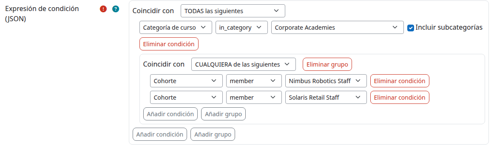

# local_themerules

*[Read in English](README.md)*

Dale a cada alumno el aspecto correcto, automáticamente — un tema y un logo
distintos por cada empresa cliente, un aspecto sin distracciones durante
los exámenes, un tema más ligero en el móvil — todo desde reglas
configuradas por el administrador. Sin código, sin configuración curso a
curso.

**📖 Véelo en acción:** un recorrido completo con capturas reales, en
[español](https://jlsimon.github.io/moodle-local_themerules/user_guide.es.html)
o [English](https://jlsimon.github.io/moodle-local_themerules/user_guide.html)
(también en este repositorio: [`docs/user_guide.es.md`](docs/user_guide.es.md) /
[`user_guide.md`](docs/user_guide.md)).

## Qué hace

Un plugin local de Moodle que selecciona dinámicamente el tema y/o el logo
de la barra de navegación que ve un usuario, según reglas evaluadas en el
servidor antes de que Moodle renderice la página — quién es, en qué
curso/categoría está, una cohorte o grupo, una etiqueta de curso, un campo
de perfil, o su tipo de dispositivo. Tres ejemplos reales, mostrados paso a
paso en la guía de arriba:

- **Marca multiempresa.** Dos empresas cliente compartiendo una misma
  instancia de Moodle, cada una viendo su propio tema y logo vaya donde
  vaya por el sitio — según la pertenencia a una cohorte.
- **Modo examen.** Cualquier curso con la etiqueta `exam-mode` cambia
  automáticamente a un tema sencillo, sin distracciones — sin
  configuración curso a curso, basta con etiquetar y quitar la etiqueta
  según haga falta.
- **Temas adaptados al dispositivo.** Un tema más ligero, pensado para
  móvil, en los teléfonos; el habitual en cualquier otro caso.

Las reglas se gestionan desde una única pantalla de administración, con un
editor visual de condiciones — sin JSON que escribir a mano, aunque la
expresión subyacente sigue siendo JSON plano (documentado más abajo) para
quien lo quiera. Si ninguna regla coincide, se aplica la selección de tema
normal de Moodle exactamente igual que si el plugin no estuviera
instalado.

## Requisitos

- Moodle 4.5 LTS o posterior (desarrollado y probado contra 5.2.1+).
- Un tema compatible con Boost para cualquier tema que una regla aplique.
- Sin extensiones PHP adicionales ni dependencias de terceros.

## Instalación

Instalación estándar de un plugin de Moodle:

1. Copia este directorio a `<moodle>/local/themerules`.
2. Visita *Administración del sitio > Notificaciones* (o ejecuta
   `php admin/cli/upgrade.php`) para completar la instalación.
3. Instalar el plugin no cambia nada por defecto: con cero reglas
   definidas, la selección de tema de Moodle no se ve afectada en
   absoluto.

## Uso básico

1. Ve a *Administración del sitio > Apariencia > Reglas de tema*.
2. Pulsa **Crear regla**.
3. Dale un nombre, elige el tema y/o el logo a aplicar, e introduce la
   expresión de condición. Tema y logo son independientes - una regla
   puede fijar uno, el otro, o ambos; dejar los dos en blanco se rechaza
   por no hacer nada.
4. Marca **Activada** y guarda.

Una regla nueva siempre se añade al final de la lista. El orden de
evaluación es el propio orden de la lista, de arriba a abajo - usa los
iconos **↑**/**↓** de la lista de reglas para reordenarlas; gana la
primera regla que coincide, igual que las listas de administración al
estilo "Gestionar autenticación" de Moodle. No hay ningún número de
prioridad aparte que fijar.

Tema y logo se resuelven de forma independiente a lo largo de todo el
conjunto de reglas, no solo dentro de una regla: si una regla anterior ya
fijó el tema, una regla posterior puede seguir aportando el logo (o
viceversa) sin sobrescribir lo que la regla anterior ya había fijado. Esto
es lo que permite que varias reglas compartan un mismo tema variando solo
el logo, sin repetir la elección de tema en cada una - ver los ejemplos
más abajo.

### Biblioteca de logos

Los logos se gestionan aparte de las reglas, en *Reglas de tema > Logos*:
sube una imagen una vez, dale un nombre, y queda disponible en el
desplegable **Aplicar logo** de cualquier regla. Subir el mismo logo de
nuevo bajo otra regla reutiliza el mismo archivo en lugar de duplicarlo.
Solo se ve afectado el logo compacto/de la barra de navegación (el que se
muestra en la mayoría de páginas); el logo completo del sitio usado en la
página de inicio de sesión es un ajuste único de Moodle a nivel de sitio y
este plugin no lo toca.

La expresión de condición se introduce como JSON en esta primera versión;
un editor visual (`amd/src/rule_editor.js`) mejora progresivamente ese
mismo campo con controles para añadir/quitar condiciones y grupos,
selectores TODAS/CUALQUIERA, así que en la práctica la mayoría de
administradores nunca necesita escribir JSON a mano - pero el textarea
sigue siendo el canal de datos real, y sigue funcionando si JavaScript no
está disponible. Los valores de `user`/`course` usan un buscador con
autocompletado en lugar de un id en crudo (escribe un nombre/correo o el
nombre de un curso para buscar); `cohort`/`coursecategory` se muestran
como un desplegable real con todo lo que ese sitio realmente tiene;
`coursegroup` es un selector en dos pasos - primero un curso, luego un
grupo dentro de él, ya que un id de grupo por sí solo no se puede
identificar sin saber su curso.

Usa **Simular** (en la misma pantalla de administración) para comprobar,
para un id de usuario y de curso dados, exactamente qué reglas coinciden,
por qué, y qué tema *y* logo se seleccionarían - sin afectar a ninguna
sesión real. Deja el id de usuario en `0` (o en blanco) para simular un
visitante anónimo, sin sesión iniciada - eso es genuinamente lo que vale
el id de un visitante real en el momento en que se resuelve el Nivel A, así
que `user is 0` en una condición ya significa "visitante anónimo" hoy, no
una referencia rota. También permite forzar el tipo de dispositivo
simulado (detectado automáticamente de tu propio navegador por defecto),
así que puedes probar una regla de `device` como "qué pasaría si esto fuera
una tablet" sin necesitar una tablet real.

### Exportar / importar

**Exportar** (disponible para cualquiera con `local/themerules:view`)
descarga todas las reglas del sitio como un único archivo JSON:
`{"format": 1, "rules": [...]}`. **Importar** (`local/themerules:manage`)
sube ese mismo tipo de archivo de vuelta - útil para copias de seguridad, o
para copiar un conjunto de reglas entre entornos que comparten los mismos
ids de usuario/curso/cohorte/grupo/logo (por ejemplo, preproducción y
producción sincronizados). Las reglas importadas siempre se añaden como
reglas nuevas, al final del orden de evaluación y **desactivadas por
defecto**, igual que al duplicar una regla - así que importar un conjunto
grande de reglas nunca empieza a afectar al tráfico real en silencio antes
de que lo hayas revisado. La importación es best-effort por regla: una
entrada mal formada en un archivo por lo demás correcto se omite y se
informa, sin ser fatal para el resto: cada regla pasa por la misma
validación exacta que pasaría una regla escrita a mano. Un valor de
`theme`/`logoid`/condición (id de usuario, curso, cohorte, grupo) que no
existe en el sitio de destino no se rechaza al importar - se importa sin
problema y simplemente se omite de forma segura en el momento de evaluar,
igual que cualquier otra regla que apunte a una entidad eliminada (ver
Solución de problemas más abajo).

### Tipos de acción

| Tipo | Valor | Notas |
|---|---|---|
| `theme` | El nombre de directorio de un tema, p. ej. `"boost"`. | Se omite de forma segura (pasando a la siguiente regla que coincida) si el tema ha sido desinstalado. |
| `logo` | Un id de logo de la biblioteca de logos (`logoid`). | Se omite de forma segura si el logo ha sido eliminado. Se aplica mediante una pequeña sobrescritura CSS inyectada en el `<head>` de cada página, no cambiando ningún ajuste global de Moodle (el logo del sitio no tiene ningún mecanismo de resolución por petición al que engancharse, a diferencia del tema). |

### Identificadores de condición

| Identificador | Operadores | Notas |
|---|---|---|
| `user` | `is` | Valor: un id de usuario. `0` coincide con un visitante anónimo, sin sesión iniciada (eso es genuinamente lo que vale su id de usuario en el Nivel A), no una referencia rota. |
| `course` | `is` | Valor: un id de curso. |
| `coursecategory` | `in_category` | Valor: un id de categoría. `"includechildren": true` opcional para coincidir también con las subcategorías. |
| `cohort` | `member`, `not_member` | Valor: un id de cohorte. |
| `coursegroup` | `member`, `not_member` | Valor: un id de grupo de curso, o `0` para significar "cualquier grupo de este curso" (refleja la propia condición "Restringir acceso > Grupo" de Moodle). Solo se puede resolver en un curso real, la misma restricción que `course`/`coursecategory`/`coursetag`. |
| `device` | `is`, `is_not` | Valor: uno de `default`, `mobile`, `tablet`, `legacy` (coincide con `\core_useragent::DEVICETYPE_*`, incluyendo el propio "ver sitio completo" del usuario). A diferencia de las demás condiciones, esta siempre se puede resolver, incluso antes de iniciar sesión. |
| `coursetag` | `has`, `not_has` | Valor: el nombre de una etiqueta, p. ej. `"exam-mode"`. Se compara sin distinguir mayúsculas/minúsculas y recortando espacios al principio/final (la misma normalización que usa el propio Moodle para las etiquetas) - `"Exam-Mode"` y `"exam-mode "` coinciden con la misma etiqueta, pero un espacio y un guion siguen siendo caracteres distintos (`"Exam Mode"` ≠ `"exam-mode"`). Solo se puede resolver en un curso real, la misma restricción que `course`/`coursecategory`. |
| `profilefield` | `is`, `is_not` | `"field"`: el nombre corto de un campo estándar (`firstname`, `lastname`, `email`, `city`, `country`, `idnumber`, `institution`, `department`, `phone1`, `phone2`, `address` - la misma lista que usa la propia condición "Restringir acceso > Campo de perfil de usuario" de Moodle) o el nombre corto de un campo de perfil personalizado con `"customfield": true`. Valor: una cadena, comparada con igualdad exacta sensible a mayúsculas (igual que el comportamiento de la propia `availability_profile` de Moodle). El editor visual ofrece como desplegable todos los campos que ese sitio realmente tiene (incluyendo los campos personalizados reales), así que rara vez se escribe a mano. |

Los nodos de grupo usan `"operator": "and"` u `"operator": "or"` con un
array `"children"` de más nodos de condición/grupo, anidados hasta 10
niveles de profundidad, hasta 100 nodos por regla.

## Ejemplos de reglas

Simple: un usuario concreto siempre obtiene `boost`, sin importar nada más:

```json
{"type": "condition", "condition": "user", "operator": "is", "value": 123}
```

Los visitantes desde móvil obtienen un tema más ligero, el resto mantiene
el tema por defecto del sitio:

```json
{"type": "condition", "condition": "device", "operator": "is", "value": "mobile"}
```

Cualquier curso con la etiqueta "exam-mode" obtiene un tema sin
distracciones:

```json
{"type": "condition", "condition": "coursetag", "operator": "has", "value": "exam-mode"}
```

Los miembros del grupo de curso 5 obtienen su propia marca; `0`
significaría en su lugar "cualquier grupo de este curso":

```json
{"type": "condition", "condition": "coursegroup", "operator": "member", "value": 5}
```

Todo aquel cuyo campo de perfil "institución" sea "UTAD" obtiene la marca
de esa institución - el escenario multiempresa para el que se construyó
originalmente la acción de logo de este plugin, ahora también accesible
desde una condición:

```json
{"type": "condition", "condition": "profilefield", "operator": "is", "field": "institution", "value": "UTAD"}
```

La misma idea con un campo de perfil personalizado (`"customfield": true`,
el valor sigue siendo una cadena simple):

```json
{"type": "condition", "condition": "profilefield", "operator": "is", "field": "employeeid", "customfield": true, "value": "99887"}
```

La cohorte "Empresa A" obtiene tanto un tema como un logo a juego desde una
sola regla. La expresión de condición no cambia respecto a los ejemplos
anteriores; lo nuevo aquí es la *acción*, que la interfaz de administración
construye automáticamente a partir de los campos **Aplicar tema**/**Aplicar
logo** como una lista en lugar de un único valor, de modo que una regla
puede fijar más de un eje:

Expresión de condición:

```json
{"type": "condition", "condition": "cohort", "operator": "member", "value": 7}
```

Acción:

```json
[
  {"type": "theme", "theme": "boost"},
  {"type": "logo", "logoid": 3}
]
```

Una regla que solo fija el logo (dejando intacto el tema que ya haya
fijado una regla anterior) usa una lista de acción de un solo elemento:
`[{"type": "logo", "logoid": 3}]`.

Combinar condiciones con grupos AND/OR es donde el editor visual
demuestra su utilidad - nadie quiere indentar JSON anidado a mano para
expresar "categoría X (incluyendo subcategorías) AND (cohorte A OR
cohorte B)". Pulsa **Añadir grupo**, elige su propio TODAS/CUALQUIERA, y
anida tan profundo como necesite el escenario (hasta 10 niveles):



## Solución de problemas

- **Una regla no parece aplicarse.** Usa el Simulador con el id de ese
  usuario (y el id de curso, si la regla usa `course`/`coursecategory`)
  para ver exactamente qué condición falló. Recuerda que las reglas se
  evalúan de arriba a abajo (el orden de la lista de reglas *es* el orden
  de evaluación) y gana la *primera* que coincide - una regla más arriba en
  la lista puede estar coincidiendo en lugar de la que esperabas. Muévela
  hacia abajo (o la tuya hacia arriba) con los iconos **↑**/**↓**.
- **Una condición `course`/`coursecategory` nunca coincide salvo en la
  página de un curso.** Es lo esperado fuera de un contexto de curso real
  (portada del sitio, área personal, páginas de administración): esos
  hechos solo se resuelven una vez que Moodle sabe cuál es el curso real
  que se está viendo.
- **Cambié una regla pero se sigue mostrando el tema antiguo.** La lista de
  reglas activadas está en caché (MUC, área `rules`). El plugin la invalida
  automáticamente en cada guardado/activación/desactivación/
  reordenación/eliminación a través de la interfaz de administración; si
  una regla se cambió por otro medio (escritura directa en la base de
  datos, un script), ejecuta *Administración del sitio > Desarrollo >
  Purgar cachés*.
- **Una condición `profilefield` nunca coincide para un visitante sin
  sesión iniciada.** Esperado: un visitante anónimo (id de `user` `0`, ver
  arriba) no tiene ningún valor de campo de perfil por definición, así que
  `is` nunca coincide para él. `is_not` siempre coincide para él en su
  lugar - una regla de campo de perfil con `is_not` también capturará por
  tanto a todo visitante anónimo, no solo a usuarios reales con un valor
  genuinamente distinto. Combínala con una condición de `device`/`user` si
  esa no es la intención.
- **Una regla apunta a un tema que ya no existe.** Se omite de forma segura
  (registrado vía `debugging()` cuando el modo de depuración de
  desarrollador está activo) y el resolutor pasa a la siguiente regla; no
  rompe la página. Lo mismo aplica a una regla que apunte a un logo
  eliminado.
- **El logo no cambia aunque la regla coincida.** Solo se ve afectado el
  logo compacto/de la barra de navegación - si tu tema lo renderiza como
  algo distinto de un `` (la mayoría de los temas de la
  familia Boost lo hacen así; un tema muy personalizado puede que no), la
  sobrescritura CSS que inyecta este plugin no tiene nada a lo que
  apuntar. Comprueba el código fuente de la página en busca de un bloque
  `<style>img.logo { content: url(...) }</style>` en el `<head>`; si falta,
  la regla no coincidió; si está presente pero no cambia nada, el problema
  está en el propio marcado del tema.
- **No cambia nada aunque haya reglas activadas.** Comprueba que el plugin
  está activado y que las capacidades `local/themerules:view`/`:manage`
  están concedidas a la cuenta que intenta administrar las reglas (el
  administrador del sitio y el arquetipo de rol `manager` las tienen por
  defecto).

## Desarrollo / pruebas

```bash
# PHPUnit (desde la raíz de Moodle, tras admin/tool/phpunit/cli/init.php)
vendor/bin/phpunit --testsuite=local_themerules_testsuite

# Behat (tras admin/tool/behat/cli/init.php / util.php --enable)
vendor/bin/behat --config <behat dataroot>/behatrun/behat/behat.yml \
  --profile=chrome --tags=@local_themerules

# Compilación JS (AMD)
node_modules/.bin/grunt amd --root=local/themerules

# Estándar de codificación
vendor/bin/phpcs --standard=moodle local/themerules
```
