# Guía de uso: Reglas de tema

*Un recorrido por tres casos de uso reales, con capturas de una ejecución
real del plugin: una plataforma de formación compartida por dos empresas,
un modo examen sin distracciones, y un tema más ligero en el móvil.*

**Existe una versión enriquecida e interactiva de esta misma guía en
[jlsimon.github.io/moodle-local_themerules/user_guide.es.html](https://jlsimon.github.io/moodle-local_themerules/user_guide.es.html).**
Also available [in English](https://jlsimon.github.io/moodle-local_themerules/user_guide.html)
([`user_guide.md`](user_guide.md)).

Reglas de tema permite a un administrador cambiar el tema y/o el logo de la
barra de navegación que ve una persona, según condiciones evaluadas en cada
carga de página: a qué cohorte pertenece, en qué curso o categoría está, una
etiqueta de curso, un campo de perfil, o el tipo de dispositivo desde el
que navega. Sin código, sin configuración curso a curso — solo una lista
ordenada de reglas, cada una con una condición y una acción, gestionada
desde una única pantalla de administración.

---

## 1. Una lista de reglas vacía

Antes de crear ninguna regla, se aplica la selección de tema normal de
Moodle a todo el mundo, exactamente igual que si el plugin no estuviera
instalado.

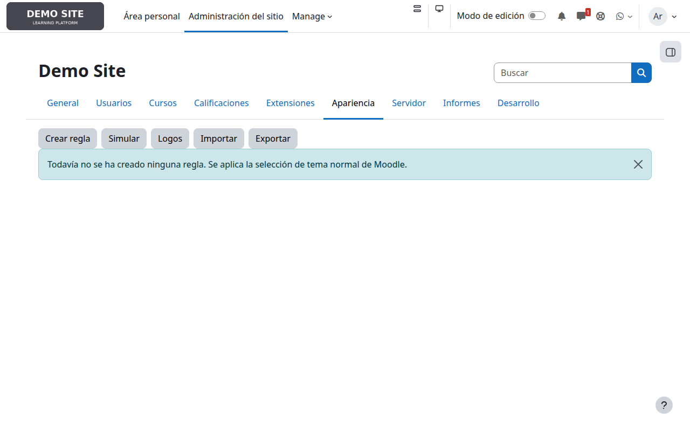

## 2. Caso de uso 1 — una plataforma, dos empresas

Imagina una única instancia de Moodle usada para impartir formación a dos
empresas cliente distintas, **Nimbus Robotics** y **Solaris Retail**. Cada
una tiene su propia categoría, sus propios cursos y su propia cohorte de
personal. Ninguna de las dos quiere ver la marca de la otra — ni el aspecto
genérico de la propia plataforma — en ningún lugar del sitio.

Crear una regla parte de un formulario sencillo: un nombre, una condición y
una acción (un tema, un logo, o ambos).

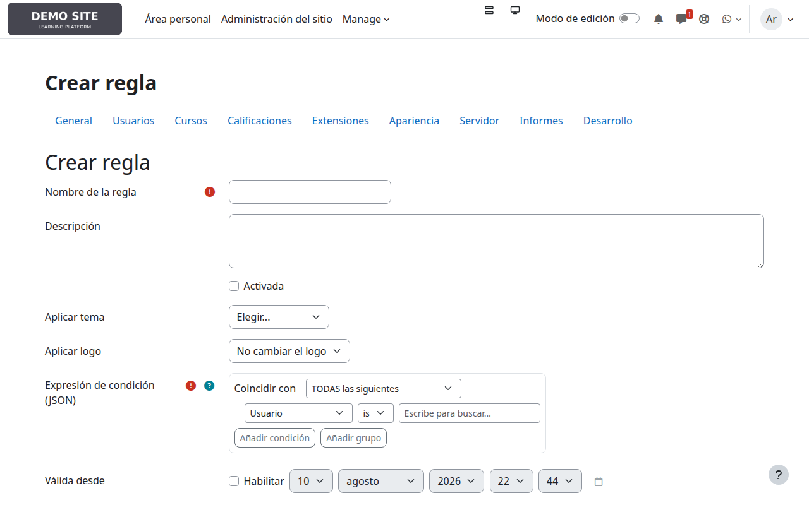

El constructor de condiciones es un pequeño editor visual, no JSON en
crudo — se elige un tipo de condición en un desplegable, y el resto de la
fila se adapta. Aquí el administrador está configurando la regla para
Nimbus Robotics: *si el usuario es miembro de la cohorte "Nimbus Robotics
Staff", aplicar el tema "cigales" y el logo de Nimbus Robotics.*

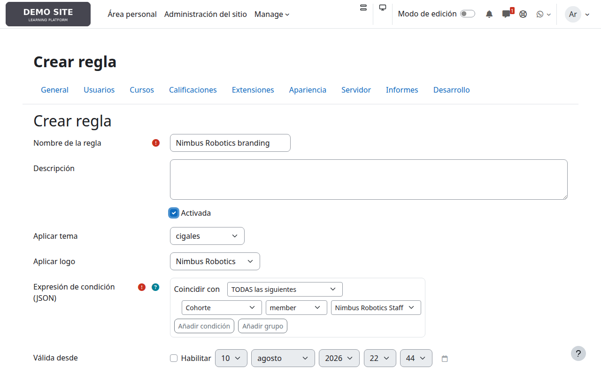

Una segunda regla, casi idéntica, para Solaris Retail (otra cohorte, otro
tema, otro logo) se añade en unos segundos. La lista ya muestra ambas, en
el orden en que se evaluarán:

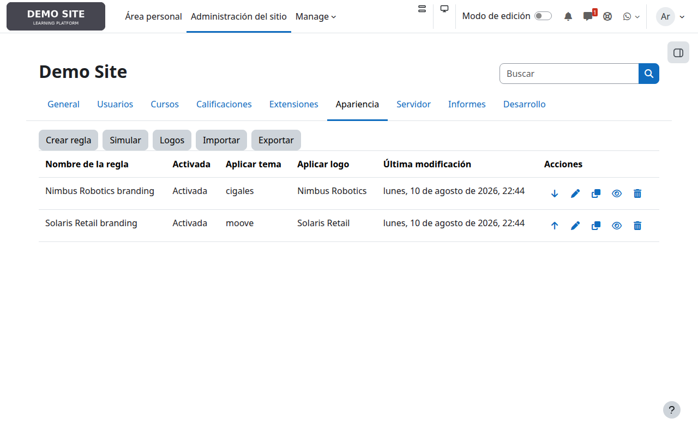

La condición está ligada a la **persona**, no a la página — así que ambas
reglas siguen en efecto vaya donde vaya esa persona por el sitio, no solo
dentro de los cursos de su propia empresa. Aquí hay dos alumnos reales,
con la sesión iniciada al mismo tiempo, viendo su propia área personal en
la misma instalación exacta de Moodle:

| Diego Torres (Nimbus Robotics Staff) | Priya Nandan (Solaris Retail Staff) |
|---|---|
| 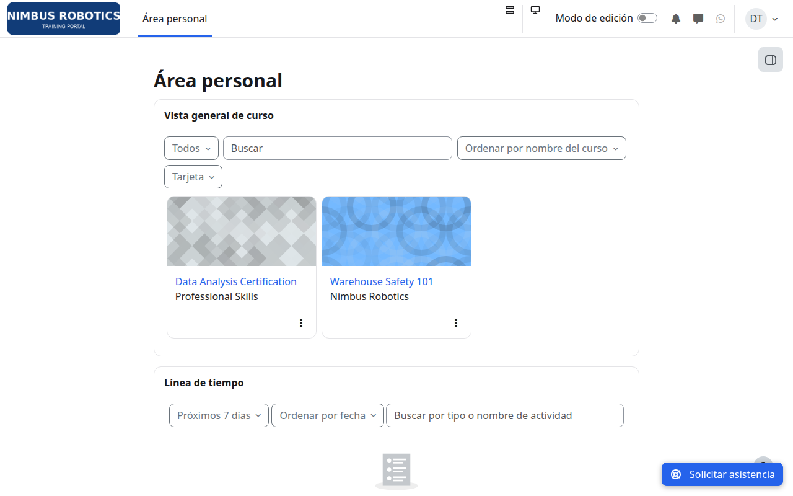 | 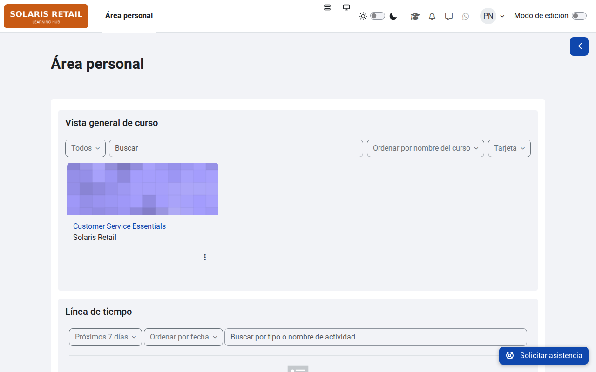 |

Ninguno de los dos ve el aspecto genérico por defecto de la plataforma, ni
la marca del otro — cada uno ve simplemente "su" sitio.

## 3. Caso de uso 2 — un tema sin distracciones durante los exámenes

Un curso distinto, sin relación con las empresas anteriores —
"Certificación en Análisis de Datos"— está abierto a alumnos individuales
sin afiliación a ninguna empresa. Sam Okafor, uno de ellos, ve el tema por
defecto habitual de la plataforma:

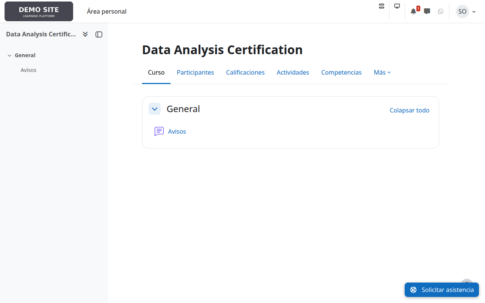

Para este caso de uso la condición no depende de *quién* es el usuario,
sino de *en qué curso* está — en concreto, de si el curso tiene una
etiqueta determinada. El administrador crea una regla que cambia al tema
sencillo "classic" siempre que un curso tenga la etiqueta `exam-mode`, sin
cambiar el logo:

Etiquetar un curso es una parte normal de editar su configuración — no hace
falta tocar la regla de nuevo para cada futura ventana de examen, basta con
añadir o quitar la etiqueta en el propio curso:

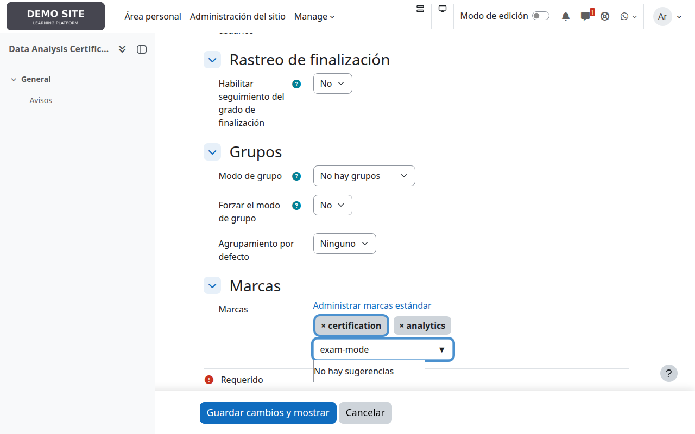

En el momento en que se guarda esa etiqueta, cualquiera que vea el curso —
Sam incluido— ve en su lugar el tema más sencillo y sin distracciones:

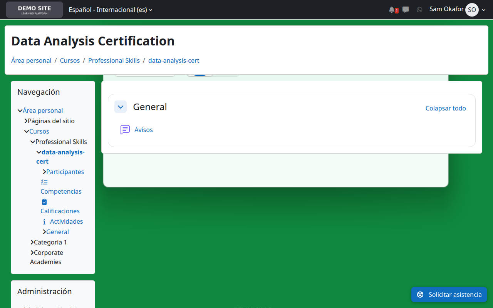

## 4. Caso de uso 3 — un tema más ligero en el móvil

El mismo tipo de condición funciona para el dispositivo desde el que
navega alguien. Esta regla cambia al tema "stream" — pensado para un
diseño de una sola columna, orientado a móvil— siempre que el tipo de
dispositivo detectado sea móvil:

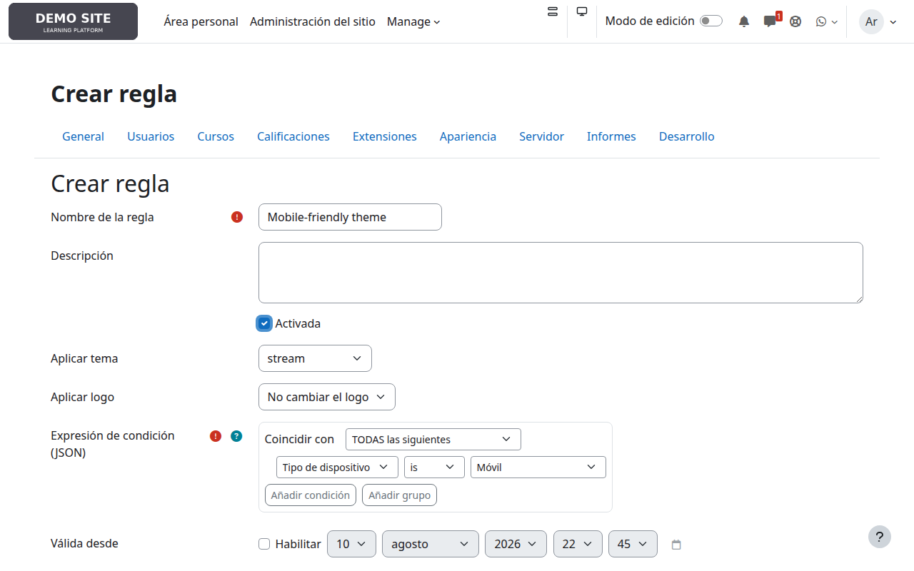

La vista de escritorio de Sam (mostrada más arriba) no se ve afectada — la
regla solo coincide con dispositivos móviles. En un móvil, el mismo curso
ahora se ve así:

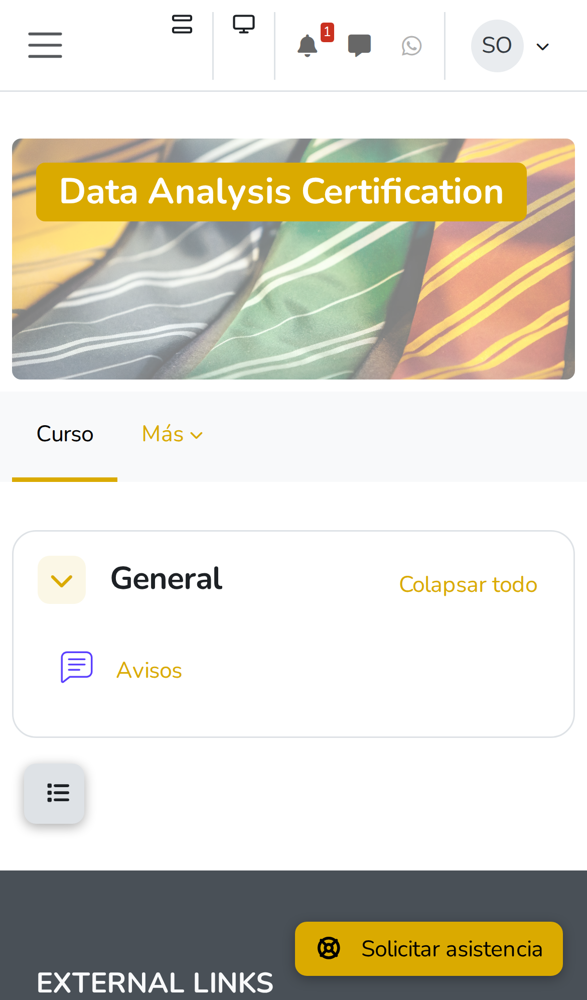

## 5. Comprobar una regla antes de activarla: el simulador

Las reglas actúan sobre tráfico real en cuanto se activan, así que conviene
poder comprobar qué resolvería en realidad una combinación concreta de
usuario, curso y dispositivo — sin tener que iniciar sesión como ese
usuario. El simulador integrado muestra la condición de cada regla, si
coincidió, y por qué:

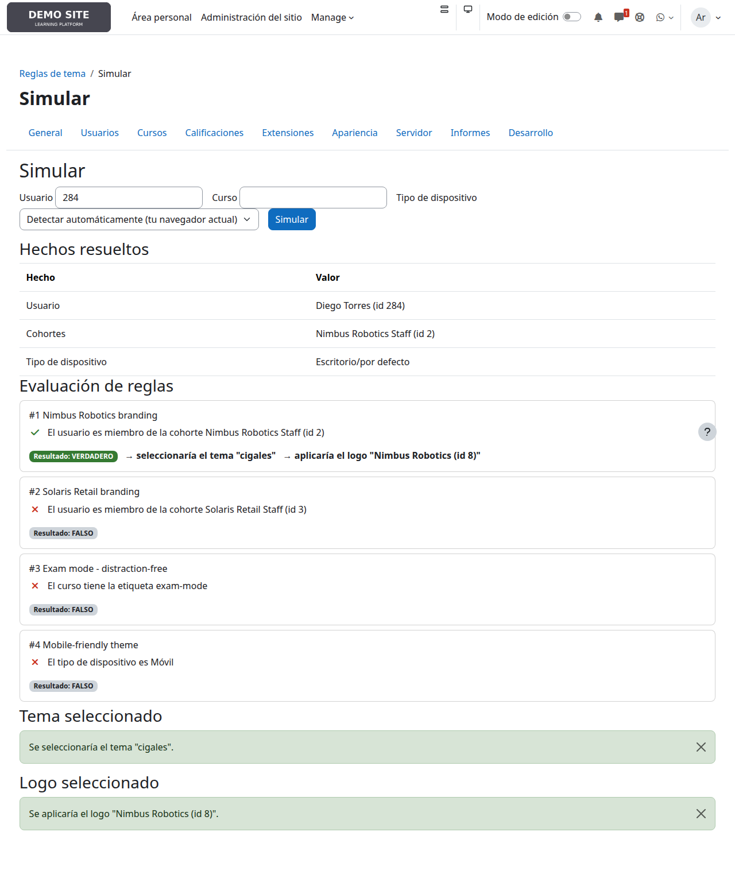

## 6. La imagen completa, y mover reglas entre sitios

La lista de reglas es también donde se ve todo junto — cuatro reglas, en
orden de evaluación, cada una con su propio tema, logo y estado
activada/desactivada:

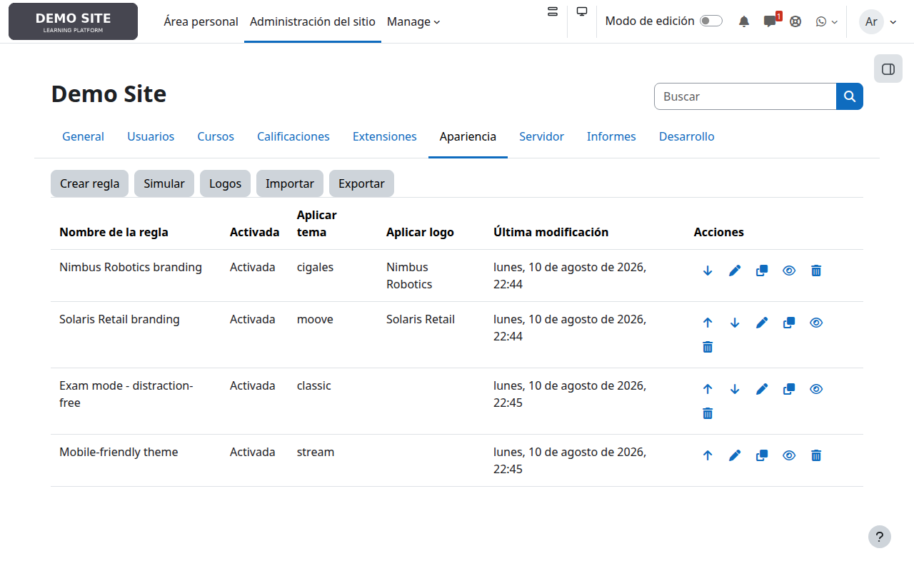

Los botones **Exportar** e **Importar** visibles en la barra de
herramientas de arriba permiten a un administrador descargar el conjunto
completo de reglas como un único archivo JSON y cargarlo en otro sitio —
útil para llevar una configuración ya probada de un sitio de pruebas a
producción, o para guardar una copia de seguridad antes de un cambio
importante. Las reglas importadas llegan siempre desactivadas, así que
nada empieza a afectar al tráfico real sin una revisión deliberada
primero.

---

## Una nota sobre cómo funciona esto

Cada captura de esta guía refleja el comportamiento real y actual del
plugin:

- Las condiciones solo leen datos que Moodle ya tiene — pertenencia a
  cohortes, categoría de curso, etiquetas de curso, un campo de perfil, o
  el tipo de dispositivo del navegador— no se rastrea ni se recopila nada
  nuevo sobre nadie.
- Una regla sin ninguna condición que coincida no cambia nada: se aplica la
  selección de tema normal de Moodle exactamente igual que si el plugin no
  estuviera instalado.
- El simulador permite a un administrador comprobar el efecto de una regla
  antes de activarla, para cualquier combinación de usuario/curso/
  dispositivo, sin necesidad de iniciar sesión como nadie.
- Las reglas importadas llegan siempre desactivadas por defecto, así que
  traer un conjunto de reglas a un sitio nuevo nunca cambia en silencio lo
  que ven los usuarios reales.

Consulta el `README.md` del proyecto y `SPECIFICATIONS_local_themerules.md`
para el detalle técnico completo detrás de estas garantías.
