# User Guide: Theme Rules

*A walkthrough of three real use cases, shown with screenshots from a live
run of the plugin: a training platform shared by two companies, a
distraction-free exam mode, and a lighter theme on phones.*

**A richer, interactive version of this same guide is available at
[jlsimon.github.io/moodle-local_themerules/user_guide.html](https://jlsimon.github.io/moodle-local_themerules/user_guide.html).**
También disponible [en español](https://jlsimon.github.io/moodle-local_themerules/user_guide.es.html)
([`user_guide.es.md`](user_guide.es.md)).

Theme Rules lets an admin change the theme and/or the navbar logo a person
sees, based on conditions evaluated on every page load: which cohort they
belong to, which course or category they're in, a course tag, a profile
field, or the type of device they're browsing from. No code, no per-course
configuration — just an ordered list of rules, each with a condition and an
action, managed from one admin screen.

---

## 1. An empty rule list

Before any rule exists, Moodle's normal theme selection applies to
everyone, exactly as if the plugin weren't installed.

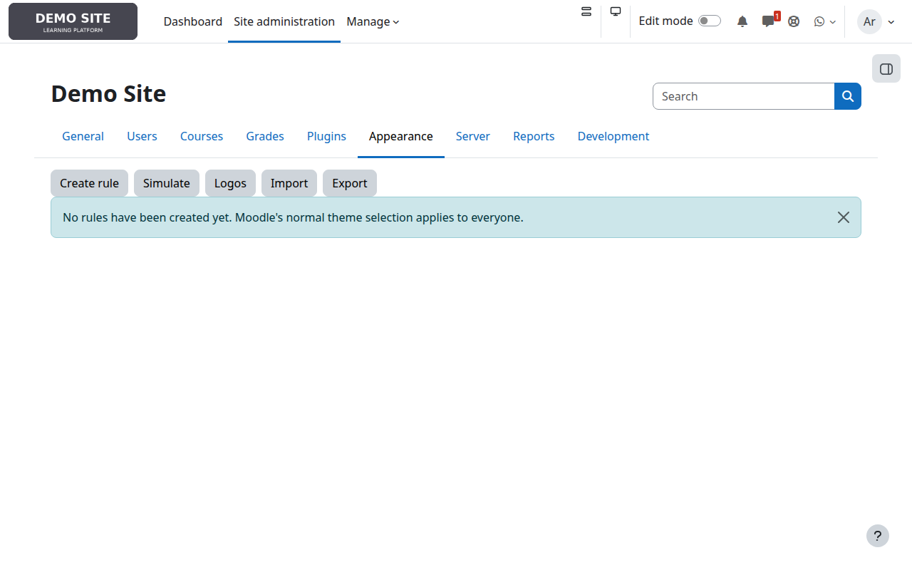

## 2. Use case 1 — one platform, two companies

Picture a single Moodle instance used to deliver training for two separate
client companies, **Nimbus Robotics** and **Solaris Retail**. Each has its
own category, its own courses, and its own staff cohort. Neither company
wants to see the other's branding — or the platform's own generic look —
anywhere on the site.

Creating a rule starts from a plain form: a name, a condition, and an
action (a theme, a logo, or both).

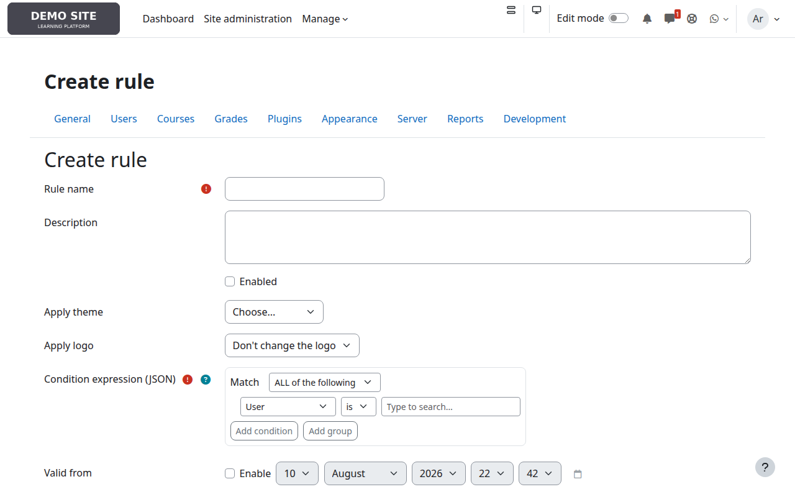

The condition builder is a small visual editor, not raw JSON — pick a
condition type from a dropdown, and the rest of the row adapts. Here the
admin is setting up the rule for Nimbus Robotics: *if the user is a member
of the "Nimbus Robotics Staff" cohort, apply the "cigales" theme and the
Nimbus Robotics logo.*

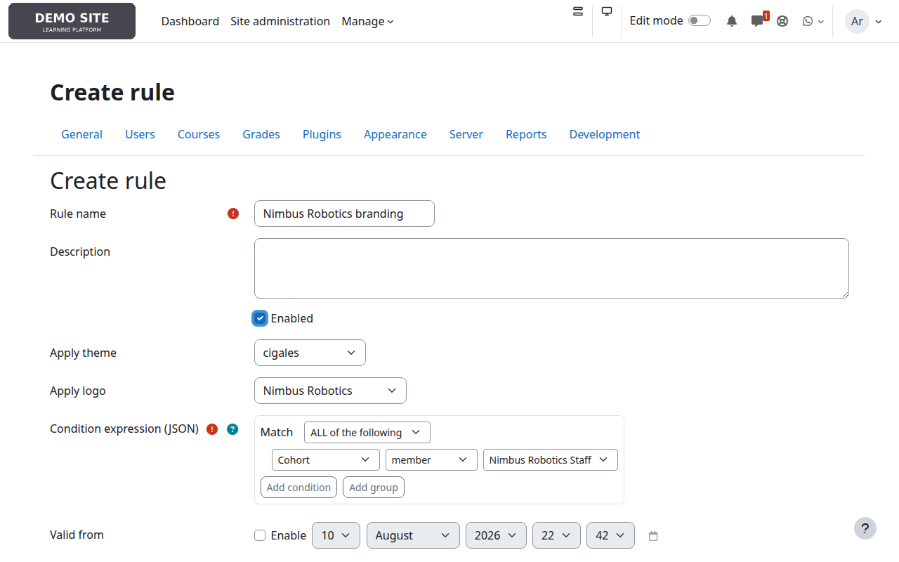

A second, near-identical rule for Solaris Retail (a different cohort, a
different theme, a different logo) takes a few seconds to add. The list now
shows both, in the order they'll be evaluated:

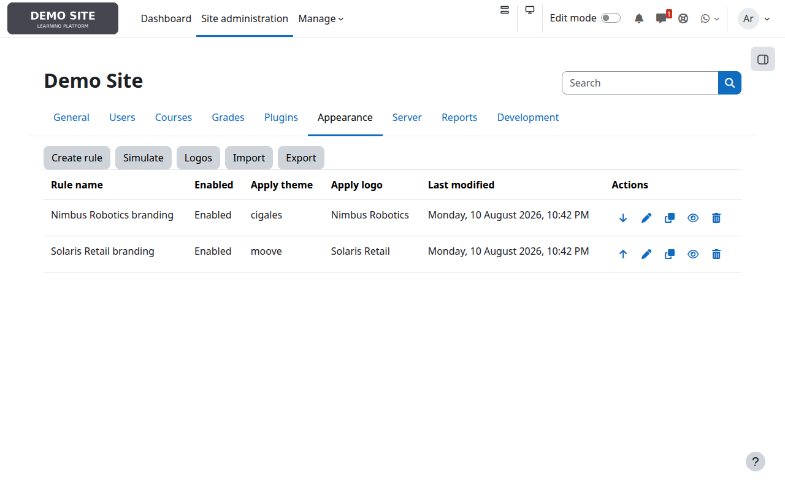

The condition is tied to the **person**, not the page — so both rules stay
in effect wherever that person goes on the site, not just inside their own
company's courses. Here are two real learners, logged in at the same time,
looking at their own dashboards on the exact same Moodle installation:

| Diego Torres (Nimbus Robotics Staff) | Priya Nandan (Solaris Retail Staff) |
|---|---|
| 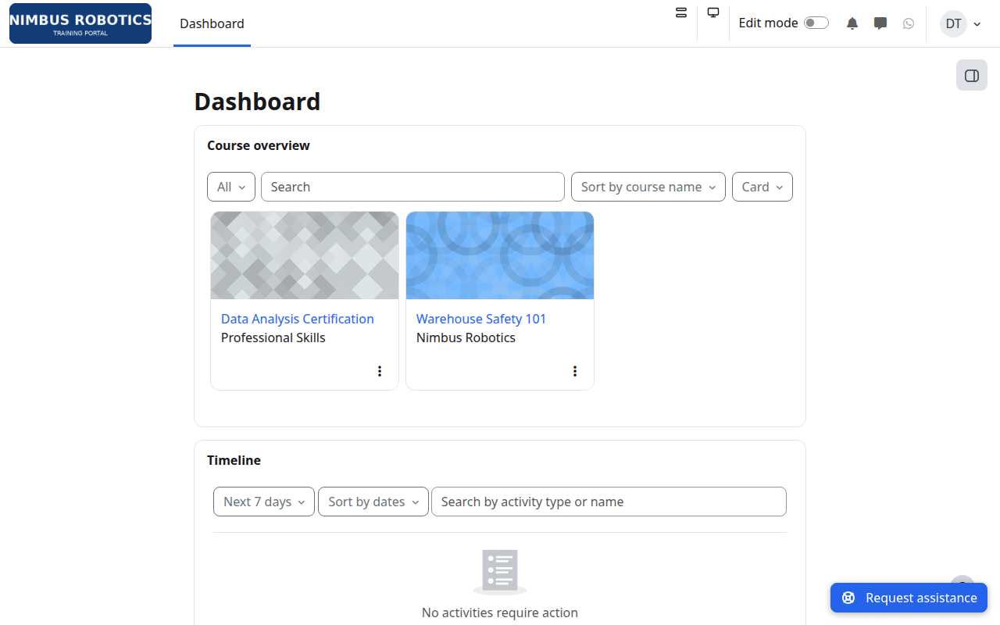 | 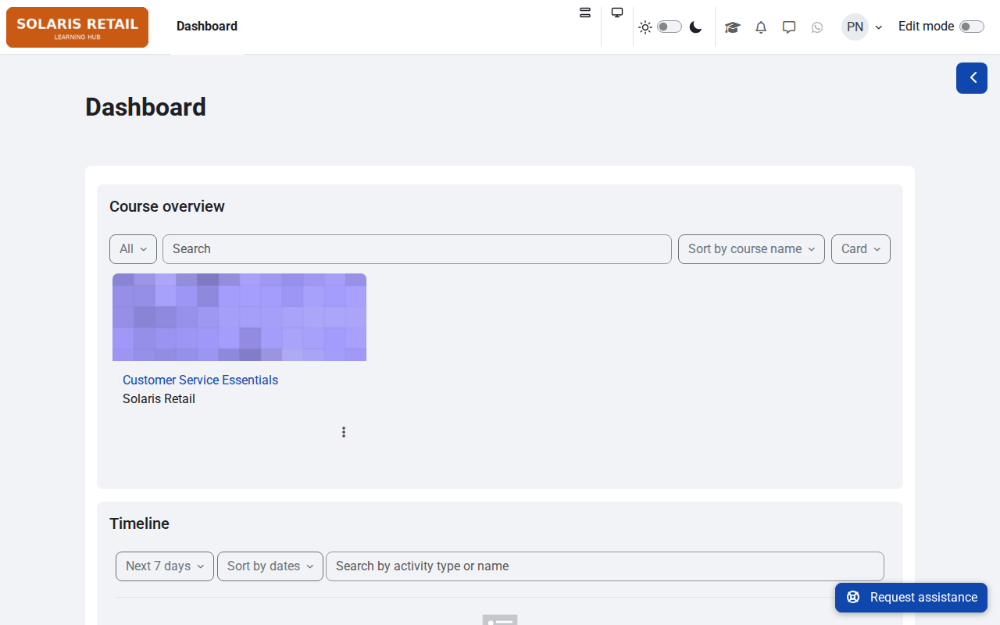 |

Neither of them sees the platform's own default look, and neither sees the
other's branding — each just sees "their" site.

## 3. Use case 2 — a distraction-free theme during exams

A different, unrelated course — "Data Analysis Certification" — is open to
individual learners with no company affiliation. Sam Okafor, one of them,
sees the platform's ordinary default theme:

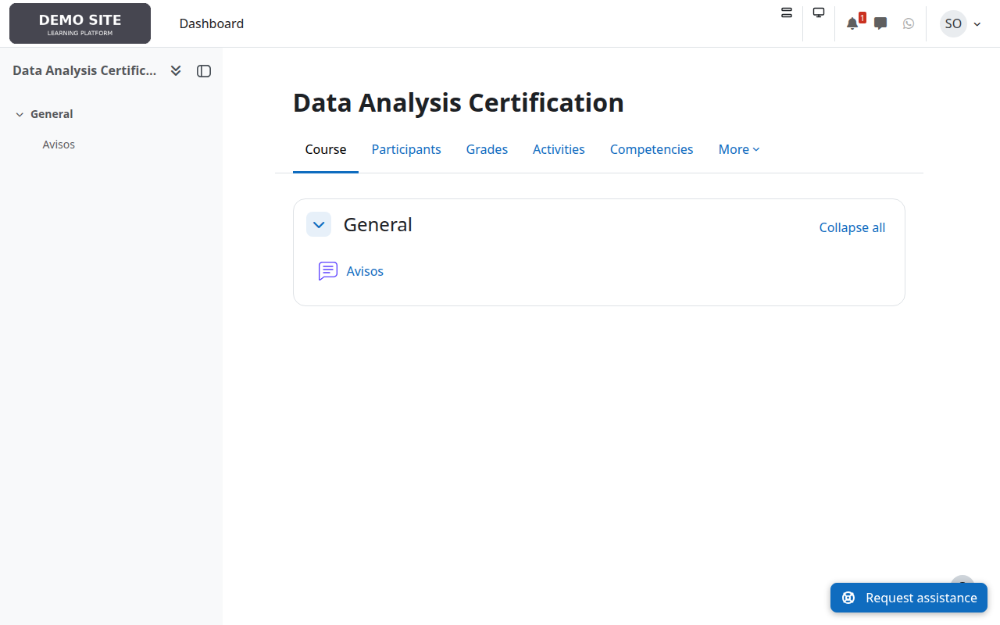

For this use case the condition isn't about *who* the user is, but *which
course* they're in — specifically, whether the course carries a given tag.
The admin sets up a rule that switches to the plain "classic" theme
whenever a course is tagged `exam-mode`, with no logo change:

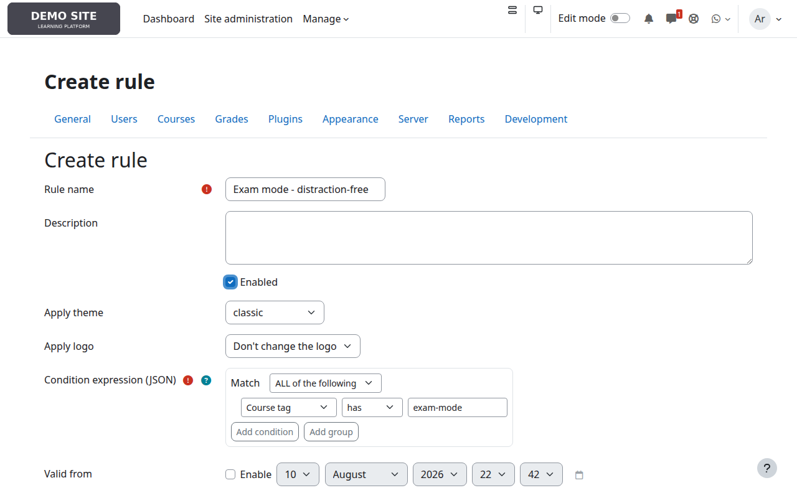

Tagging a course is an ordinary part of editing its settings — no need to
touch the rule again for every future exam window, just add or remove the
tag on the course itself:

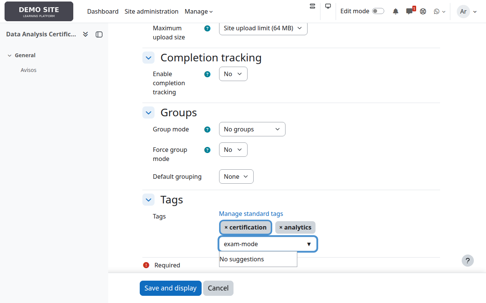

The moment that tag is saved, anyone viewing the course — Sam included —
sees the plainer, distraction-free theme instead:

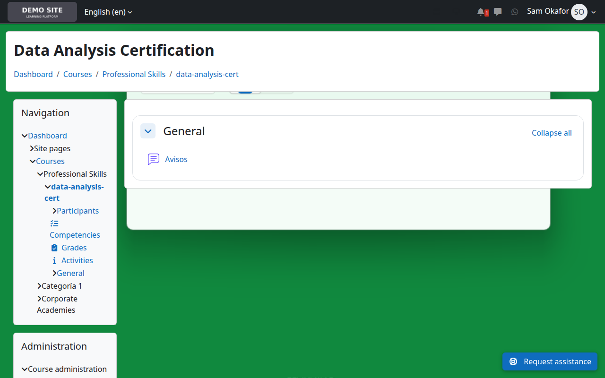

## 4. Use case 3 — a lighter theme on phones

The same kind of condition works for the device someone is browsing from.
This rule switches to "stream" — a theme built around a mobile-first,
single-column layout — whenever the device type is detected as mobile:

Sam's desktop view (shown above) is unaffected — the rule only matches
mobile devices. On a phone, the same course now looks like this:

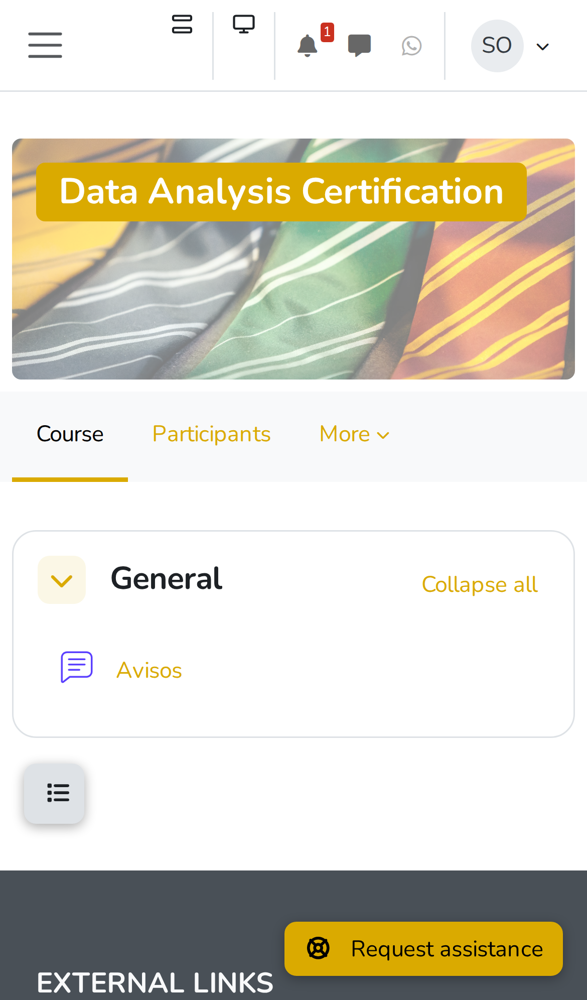

## 5. Checking a rule before it goes live: the simulator

Rules act on real traffic the moment they're enabled, so it helps to check
what a given user, course and device combination would actually resolve
to — without having to log in as that user. The built-in simulator shows
every rule's condition, whether it matched, and why:

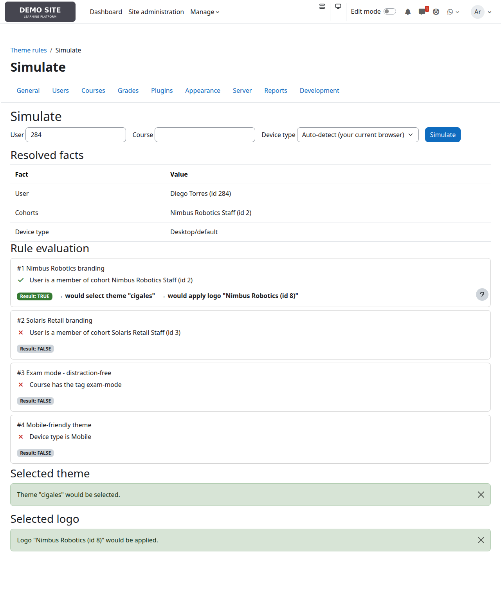

## 6. The full picture, and moving rules between sites

The rules list is also where everything comes together — four rules, in
evaluation order, each with its own theme, logo and enabled/disabled state:

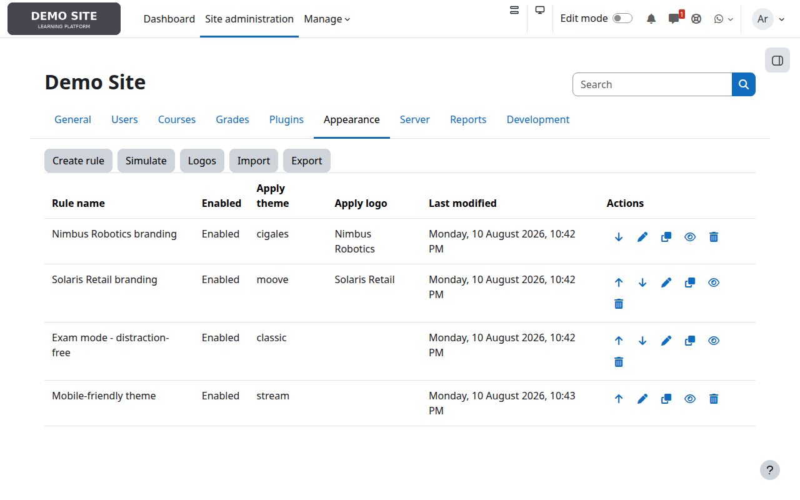

The **Export** and **Import** buttons visible in the toolbar above let an
admin download the full rule set as a single JSON file and load it into
another site — useful for moving a working setup from a staging site to
production, or keeping a backup before a big change. Imported rules always
arrive disabled, so nothing starts affecting real traffic without a
deliberate review first.

---

## A note on how this works

Every screenshot above reflects the plugin's actual, current behavior:

- Conditions only ever read data Moodle already has — cohort membership,
  course category, course tags, a profile field, or the browser's device
  type — nothing new is tracked or collected about anyone.
- A rule with no matching condition changes nothing: Moodle's normal theme
  selection applies exactly as if the plugin weren't installed.
- The simulator lets an admin check a rule's effect before enabling it, for
  any user/course/device combination, without needing to log in as anyone.
- Imported rules are always disabled by default, so bringing a rule set
  into a new site never silently changes what real users see.

See the project's `README.md` and `SPECIFICATIONS_local_themerules.md` for
the full technical detail behind these guarantees.
